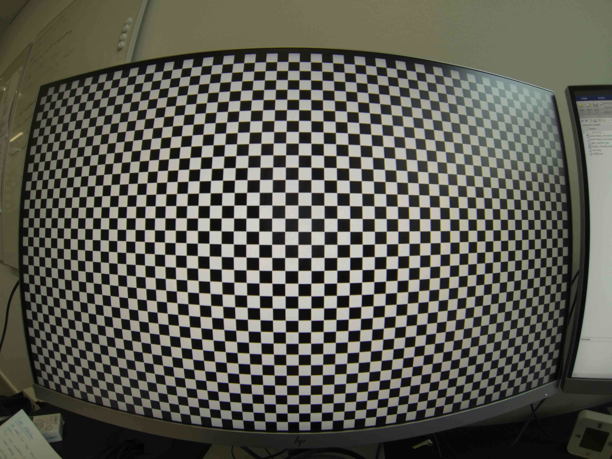
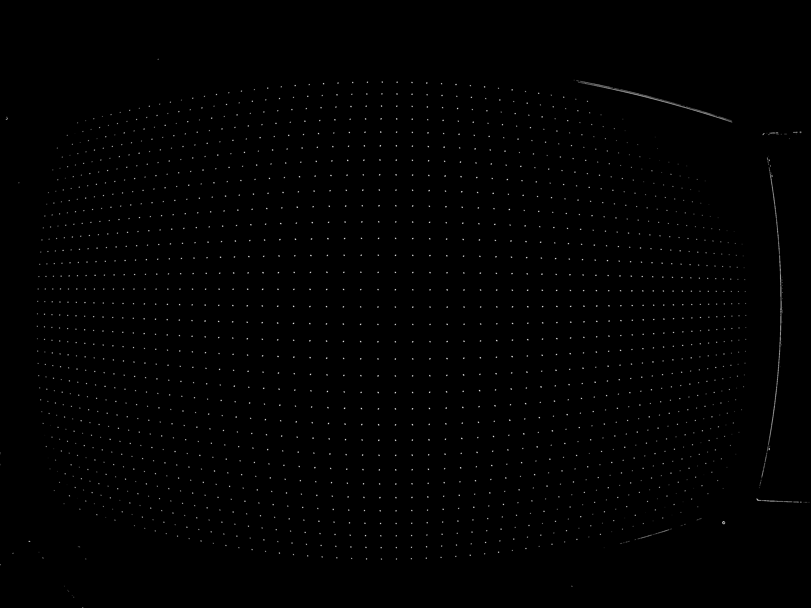

# Tutorial - Camera calibration using large chess boards
This tutorial will demonstrate how to calibrate a camera using a set of two images of a calibration target with a chess board pattern. 

This tutorial assumes that you already have [installed the programme](Howto-InstallTheProgramme.md).

The two images can be found in the `input/testdata` directory and they looks as follows.
`pic/GOPR0003red.jpg`


`pic/GOPR0011red.jpg`


To use all images in the `input/testdata/` to calibrate a camera, enter the following command line.
```
:~/Desktop/camera-calibration-with-large-chessboards$ pipenv run python calibration.py -i input/testdata/ -o output/testdata --debug --kernel_size 25
```

The program will then list the image files that have been analyzed `GOPRO0003red.JPG` and `GOPRO0011red.JPG` and the determined camera calibration parameters in form of a camera matrix and a set of distortion parameters.
```
GOPR0003red.JPG
GOPR0011red.JPG
Calibration matrix: 
[[1.74378054e+03 0.00000000e+00 1.99327424e+03]
 [0.00000000e+00 1.74585672e+03 1.45203254e+03]
 [0.00000000e+00 0.00000000e+00 1.00000000e+00]]
Distortion parameters (k1, k2, p1, p2, k3):
[[-0.26280262  0.08307492 -0.00104023 -0.00029683 -0.01192781]]
```

## Debugging output from the calibration process
In addition to the determined camera parameters that are printed on the screen, a lot of details from the calibration process is saved in the specified output directory. This includes a text file and some images that might be helpful in tracking down suspicious calibration results.

The content of the `camera_calibration_extended.txt` file is shown here.
```
Time of calibration: 
2022-12-01 15:35:01

Calibration matrix: 
[1743.78054241    0.         1993.27424476]
[   0.         1745.85671864 1452.0325352 ]
[0. 0. 1.]

Distortion parameters (k1, k2, p1, p2, k3):
[[-0.26280262  0.08307492 -0.00104023 -0.00029683 -0.01192781]]

Summary statistics:
Image                    Coverage    Avg distor bef   Avg distor aft
GOPR0003red.JPG           31%        9.64             0.39
GOPR0011red.JPG           80%        54.39            0.73

Average horizontal distortion before:24.360 pixels from ideal line
Average vertical distortion before:  15.320 pixels from ideal line
Average horizontal distortion after:  0.320 pixels from ideal line
Average vertical distortion after:    0.500 pixels from ideal line
Images with a coverage lower than 25% are excluded from the calibration

Extended statistics:
	GOPR0003red.JPG
	Percentage of image covered with points: 31%
		Before undistorting:
			Horizontal points : 1940
			Average horizontal distortion: 5.863
			Vertical points : 1940
			Average vertical distortion: 7.564
		After undistorting:
			Horizontal points : 1666
			Average horizontal distortion: 0.212
			Vertical points : 1666
			Average vertical distortion: 0.355
	GOPR0011red.JPG
	Percentage of image covered with points: 80%
		Before undistorting:
			Horizontal points : 1834
			Average horizontal distortion: 42.853
			Vertical points : 1834
			Average vertical distortion: 23.069
		After undistorting:
			Horizontal points : 1128
			Average horizontal distortion: 0.416
			Vertical points : 1128
			Average vertical distortion: 0.629
```

One example of the saved files is this image, which displays the detected corner locations of the chessboard. The image can be found in this location:
`output/testdata/3_relative_response_thresholded/`
