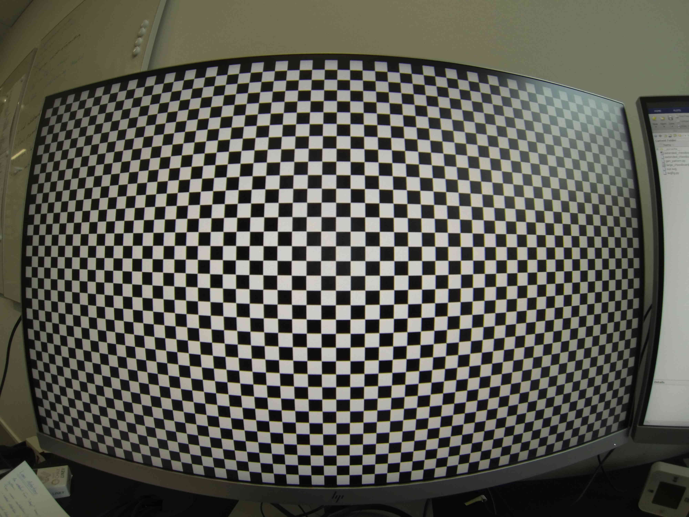
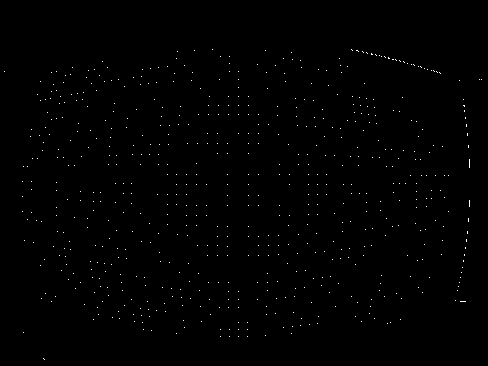

# Tutorial - Camera calibration using large chess boards
This tutorial will demonstrate how to calibrate a camera using a set of two images of a calibration target with a chess board pattern. 

This tutorial assumes that you already have [installed the programme](Howto-InstallTheProgramme.md).

The two images can be found in the `input/testdata` directory and they looks as follows.
`pic/GOPR0003red.jpg`


`pic/GOPR0011red.jpg`


To use all images in the `input/testdata/` to calibrate a camera, enter the following command line.
```
uv run calibration.py -i input/testdata/ -o output/testdata --debug --kernel_size 25
```

The program will then list the image files that have been analyzed `GOPRO0003red.JPG` and `GOPRO0011red.JPG` and the determined camera calibration parameters in form of a camera matrix and a set of distortion parameters.
```
GOPR0011red.JPG
GOPR0003red.JPG
Calibration: 73it [00:01, 65.52it/s, error=116]    
LM: Stopped after 73 iterations.
Calibration matrix: 
[[1.73744168e+03 0.00000000e+00 1.99701461e+03]
 [0.00000000e+00 1.73945615e+03 1.45191407e+03]
 [0.00000000e+00 0.00000000e+00 1.00000000e+00]]
Calibration matrix uncertainties:
[[54.4732111   0.         15.73548631]
 [ 0.         53.9530853  14.44844693]
 [ 0.          0.          1.        ]]
Distortion parameters (k1, k2, p1, p2, k3):
[-0.26835601  0.09001545 -0.00105902 -0.0003537  -0.01398491]
Distortion parameters (k1, k2, p1, p2, k3) uncertainties:
[0.01499931 0.00980549 0.00078415 0.00048409 0.00235576]
```

## Debugging output from the calibration process
In addition to the determined camera parameters that are printed on the screen, a lot of details from the calibration process is saved in the specified output directory. This includes a text file and some images that might be helpful in tracking down suspicious calibration results.

The content of the `camera_calibration_extended.txt` file is shown here.
```
Time of calibration: 
2026-03-06 10:21:50

Calibration matrix: 
[1737.44168375    0.         1997.01460502]
[   0.         1739.45615037 1451.91406848]
[0. 0. 1.]

Calibration matrix uncertainties: 
[54.4732111   0.         15.73548631]
[ 0.         53.9530853  14.44844693]
[0. 0. 1.]

Distortion parameters (k1, k2, p1, p2, k3):
[[-0.26835601  0.09001545 -0.00105902 -0.0003537  -0.01398491]]
Distortion parameters (k1, k2, p1, p2, k3) uncertainties:
[0.01499931 0.00980549 0.00078415 0.00048409 0.00235576]

Summary statistics:
Image                    Coverage    Avg distor bef   Avg distor aft
GOPR0011red.JPG           78%        48.91            1.72
GOPR0003red.JPG           31%        9.61             0.72

Average horizontal distortion before:22.040 pixels from ideal line
Average vertical distortion before:  14.460 pixels from ideal line
Average horizontal distortion after:  0.780 pixels from ideal line
Average vertical distortion after:    0.880 pixels from ideal line
Images with a coverage lower than 25% are excluded from the calibration

Extended statistics:
	GOPR0011red.JPG
	Percentage of image covered with points: 78%
		Before undistorting:
			Horizontal points : 1737
			Average horizontal distortion: 38.207
			Vertical points : 1737
			Average vertical distortion: 21.407
		After undistorting:
			Horizontal points : 1495
			Average horizontal distortion: 1.124
			Vertical points : 1495
			Average vertical distortion: 1.195
	GOPR0003red.JPG
	Percentage of image covered with points: 31%
		Before undistorting:
			Horizontal points : 1934
			Average horizontal distortion: 5.861
			Vertical points : 1934
			Average vertical distortion: 7.502
		After undistorting:
			Horizontal points : 1909
			Average horizontal distortion: 0.435
			Vertical points : 1909
			Average vertical distortion: 0.568
```

One example of the saved files is this image, which displays the detected corner locations of the chessboard. The image can be found in this location:
`output/testdata/3_relative_response_thresholded/`
